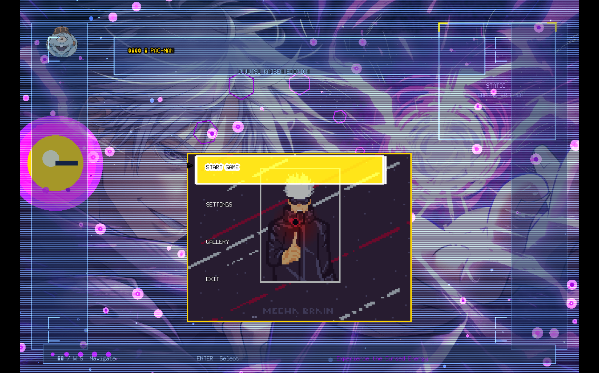
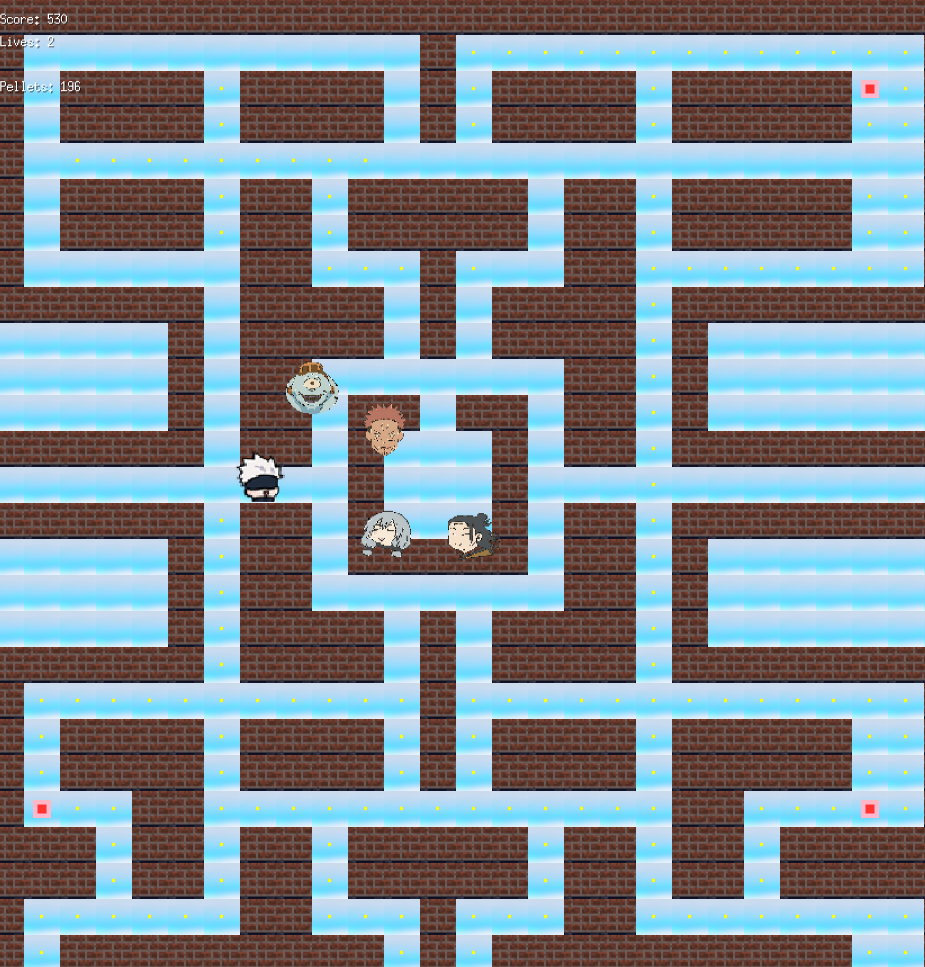
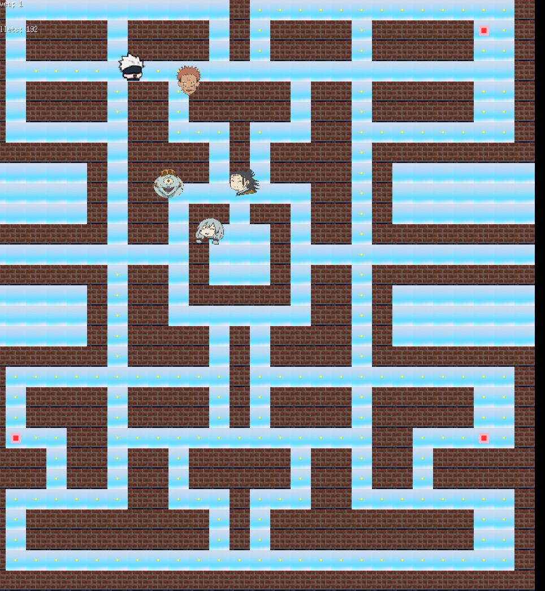
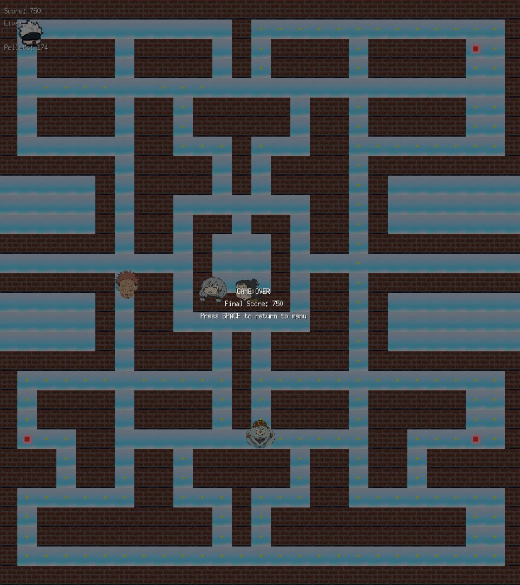
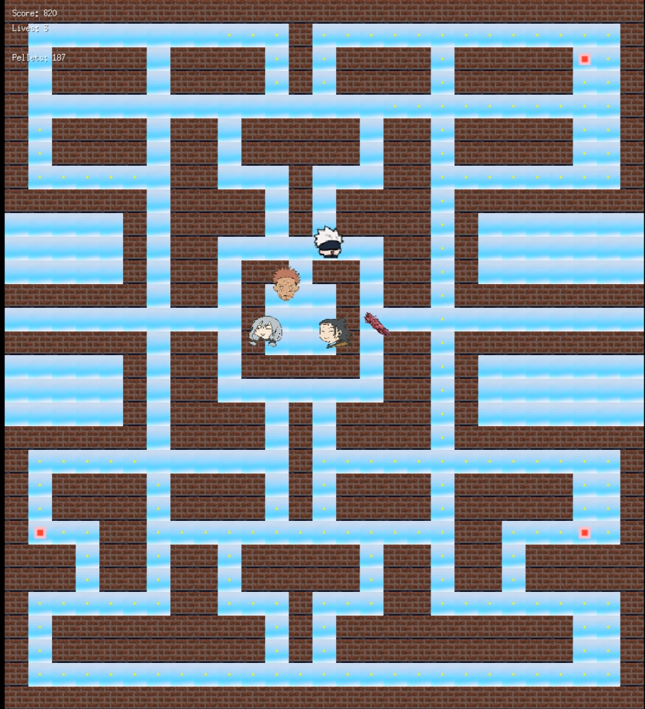

# 🌀 Jujutsu Kaisen Edition: PAC-MAN 

A custom **Pac-Man-style arcade game** built in **Go** using the **Ebiten game engine**, featuring characters and theming inspired by **Jujutsu Kaisen**. Navigate Gojo through cursed mazes, collect pellets, and avoid powerful curses like Sukuna, Jogo, Kenjaku, and Mahito.(work under progress)

---

## 🎮 Features

- 🧠 **Ghost AI** that chases the player using pathfinding
- 🌌 **Custom sprites** from the JJK universe
- 🍒 **Pellet and power-pellet system**
- 🟣 **Fright mode** for ghosts. 
- 🧱 **Dynamic maze** with tiles and walls
- 🎵 **UI Menu** with animated background and options
- 💥 **Score tracking and lives system**
- 🔁 **Reset and restart functionality**

---

## 🛠 Tech Stack

- **Go (Golang)**
- **Ebiten** (2D game engine)
- **Go’s `image`, `gif`, `os`, and `embed` packages**
- **Tiled map style level layout**

---

## 📦 Assets

- Custom sprites: `assets/`
- Player GIF: `assets/gojo.gif`
- Ghosts: `assets/sukuna.png`, `assets/jogo.png`, `assets/kenjaku.png`, `assets/mahito.png`
- Background: `assets/cursed_bg.png`
- Fonts: `assets/PressStart2P-Regular.ttf`

> All assets are inspired by Jujutsu Kaisen and used for non-commercial, educational purposes.

---

## 🚀 Running the Game

### 🔧 Prerequisites

- Go 1.18+
- Ebiten library installed:
```bash
go get github.com/hajimehoshi/ebiten/v2
./run-game.sh # for linux
```
```bash
###folder structure
├── assets/              # Sprites, GIFs, backgrounds, font
├── audio/               # audios for game
files
├── game.go              # Core game logic
├── main.go              # Game entry point
├── player.go            # Player movement and collision
├── ghost.go             # Ghost AI and pathfinding
├── menu.go              # UI menu with options
├── assets.go            # Asset loader (image & GIF)
├── ghostAI.go
├── intro.go
├── pellet.go
├── menu.go
├── cherry.go
├── audio.go
├── game
├── run-game.sh
├── README.md            # This file
```
## 📸 Screenshots

### 🏁 Main Menu  

!(game/assets/newmenue.png)

### 🎮 Gameplay  




